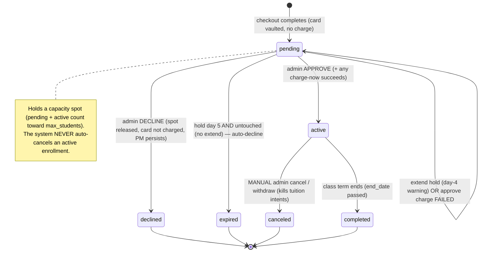
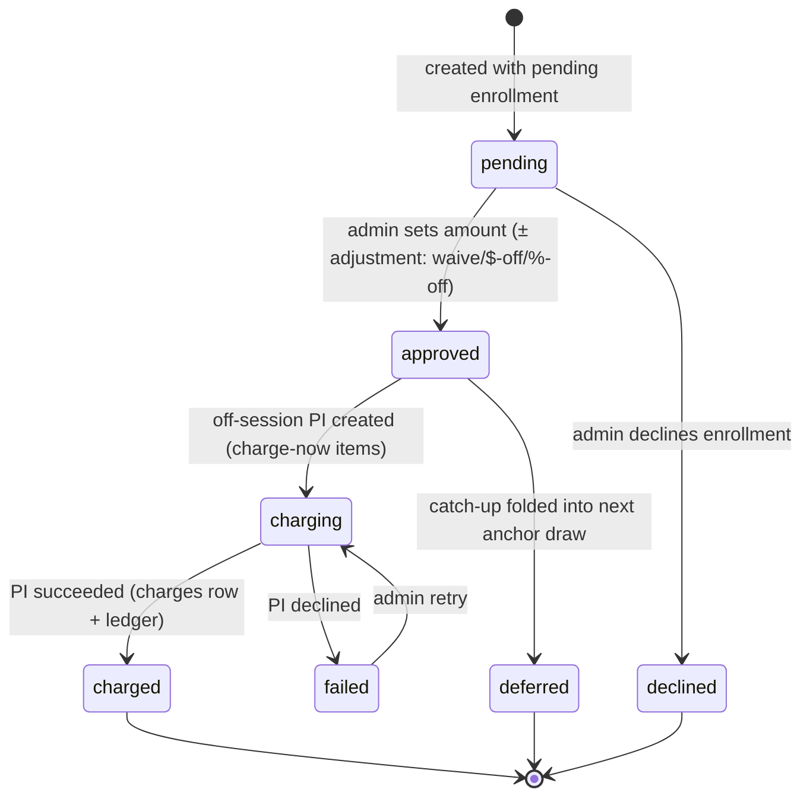
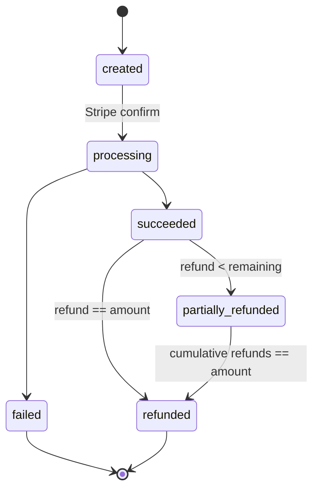
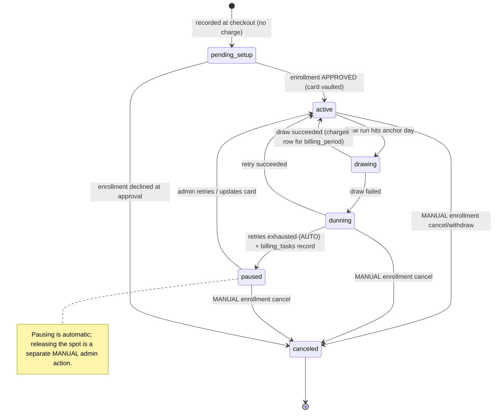

# BILLING_APPROVAL_AND_DRAW.md — Enrollment Approval, Charging & Monthly Tuition Draw

> **Status:** Draft spec — *spec only, no code.* **Decisions locked 2026-07-17 (see §10).**
> **Author:** Platform build (Derek) · **Date:** 2026-07-17
> **Module:** M7 Registration & Enrollment + M-billing (Commerce)
> **Supersedes direction of:** `docs/AUTHORIZATION_CHECKOUT.md` §4 / §4.6 (which charges the
> registration fee inside the Stripe Checkout Session). Under this spec **nothing is charged at
> checkout except merchandise** (and merch charge-at-checkout is itself **deferred** — §1.3) —
> checkout becomes vault-only, and the registration fee moves to **admin approval time**.
> `AUTHORIZATION_CHECKOUT.md` now carries a deprecation header pointing here, and this doc is
> registered as canonical in `docs/_INDEX.md` (Billing section + Spec Manifest). ✅ Done.

---

## 0. Core model (the one-paragraph version)

A parent completes checkout. **No money moves** (merch charge-at-checkout is deferred — §1.3).
Checkout **vaults** the card / captures the ACH mandate (Stripe `setup` mode), creates the
enrollment as **`status = "pending"`**, and records **pending charge items** — the registration fee
plus a **prorated first draw** covering the student's **start date → next anchor date** (payment is
in advance of delivery). The enrollment sits in an **admin approval queue**. When an admin
**approves**, the platform runs an **off-session charge** (registration + prorated catch-up) against
the vaulted method — or, if the admin **defers**, folds the catch-up into the next anchor draw —
**activates** the enrollment, posts the revenue to the **ledger**, and arms the **recurring monthly
tuition intent** (drawn on the tenant's **anchor day, default 15**). **Decline** releases the held
spot, notifies the parent (stating the card was **not** charged), and nothing is ever charged; the
vaulted method persists. Every charge is written as a **reversible ledger group** with a first-class
`charges` record, so full and partial **refunds** (admin discretion) are possible from day one
(refund *UI/workflow* is a separate follow-on; only the *data model* is specified here).

**Design invariants**
- **No charge at checkout except merch** (and merch is deferred — §1.3). Registration + tuition are
  authorized-only until approval.
- **Admin approval is the single gate** between "parent paid attention" and "money moves."
- **The system never auto-cancels an enrollment.** Automated billing may *pause* an intent; releasing
  a spot is always a separate, manual admin action (§5.5–§5.6, §10 decision 13).
- **Every money movement is a `charges` row + a balanced ledger group.** No ad-hoc Stripe calls
  that skip the ledger.
- **Refunds are admin discretion by default (no deadline)** — partial refunds each linked to their
  original charge, posted as a reversal group (`post_ledger_group(p_reversal_of => …)`, which already
  exists). Refund-policy windows are **SaaS tenant config**, disabled for this tenant.
- **Adjustments (waive / $-off / %-off) apply to any charge item**, with a required reason, logged.
- **Idempotent everywhere** — webhooks retry, crons re-run; never double-create, never double-draw.

---

## 1. Checkout changes — from "charge registration" to "authorize / vault only"

### 1.1 Today (to be migrated)
`app/api/enrollment/checkout/route.ts` builds a Stripe **Checkout Session** in `mode: "payment"`
whose line items are the **immediate** lines (registration fee), with
`payment_intent_data.setup_future_usage = "off_session"` to vault the card. The
`app/api/enrollment/webhook/route.ts` handler, on `checkout.session.completed`, **creates the
enrollment as `status:"active"`**, posts the registration to the ledger as `direct_sale_captured`,
and records scheduled tuition intents. **This charges registration at checkout and auto-activates —
both change here.**

### 1.2 Target checkout

| Aspect | Today | Target |
|---|---|---|
| Stripe mode | `payment` (charges registration) | **`setup`** (no charge) — creates a `SetupIntent`, vaults card / captures ACH mandate |
| Money moved at checkout | Registration fee | **$0** for enrollment; **merch only** (see §1.3) |
| Enrollment status on completion | `active` | **`pending`** |
| Registration / first tuition | Charged now | Recorded as **pending charge items** (§2), charged at approval (§3) |
| Card persistence | On PI success | On `setup_intent.succeeded` → persist `payment_method` to `families.stripe_payment_method_id` |

**Webhook events after migration** (enrollment path):
- `checkout.session.completed` with a **setup-mode** session → create/confirm the `pending`
  enrollment, persist the vaulted `payment_method` to the family, generate the pending charge items.
  (Setup mode has no `payment_status`/settlement concern — the ACH *mandate* is captured, not a
  debit.)
- `setup_intent.succeeded` (belt-and-suspenders) → ensure `families.stripe_payment_method_id` is set.
- `checkout.session.expired` → mark cart expired (unchanged).
- The current `async_payment_succeeded` / `async_payment_failed` handlers for enrollment become
  **unused for enrollment** (no debit at checkout) — they remain only for the **merch** charge path.

**Idempotency anchor stays the same shape:** pending enrollment keyed on
`(setup_intent_id or checkout_session_id, student_id, class_id)`. The current key uses
`stripe_payment_intent_id`; in setup mode there is no PaymentIntent, so add a
`stripe_setup_intent_id` / `checkout_session_id` anchor (see §9).

### 1.3 Merchandise line-item split (charge-at-checkout, future)

Merch charge-at-checkout is **deferred** (§10 decision 14) — but the cart/line model is designed now
so it drops in later without re-plumbing:

- Every cart line carries a **`settlement_mode`**: `"charge_now"` (merch, future) | `"authorize"`
  (enrollment: registration + tuition). Today everything enrollment-related is `"authorize"`; the
  `"charge_now"` bucket stays unused until merch ships.
- When merch lands, checkout builds **two buckets**:
  - **charge_now bucket** → a `payment`-mode Session / PaymentIntent that captures immediately and
    posts a `direct_sale_captured` ledger group.
  - **authorize bucket** → the `setup`-mode vaulting flow above; produces pending charge items.
- Mixed cart (merch + enrollment): vault first (setup), then charge merch off-session against the
  just-vaulted PM. (Decide at build; not blocking, and not built in this slice.)
- `checkout-lines.ts` generalizes from `{ immediate, scheduled }` to
  `{ chargeNow, authorizeThenApprove, scheduled }`. Registration moves out of `immediate` into
  `authorizeThenApprove`.

---

## 2. Pending charge items (the approval-queue payload)

When a `pending` enrollment is created, generate one **`enrollment_charge_item`** row per amount the
admin will approve. Each item carries a **`recurrence_type`** (§10 decision 14):

- **`recurring`** — arms a `tuition_schedule_intent` on approval (monthly tuition).
- **`one_time`** — no intent; single charge (registration, fees, private-lesson packs). Its default
  recommendation is **charge-now (at approval)**.

| item_type | recurrence_type | recommended_amount_cents | Notes |
|---|---|---|---|
| `registration` | `one_time` | `studio_settings.registration_fee_cents` | Publicly **non-refundable** (policy copy); refundable at admin discretion (§6). Adjustable (§3.2). |
| `first_tuition` | `recurring` | **prorated** start→next-anchor draw (§4) | Recommendation; admin can adjust or defer |
| `one_time_fee` / `private_pack` | `one_time` | item price | Cart upsells (e.g. private-lesson packs) ride the normal approval flow; default charge-now |

Each item is `status = "pending"` and carries the **recommendation** plus (for prorated items) a
`proration` JSON blob (so the admin sees *why* the number is what it is). Registration and flat fees
carry no proration blob. The **recurring** monthly tuition itself is *not* a charge item — it's the
`tuition_schedule_intent` (§5), armed only after approval of the `first_tuition` (recurring) item.
Promo codes are a **future** layer that will ride the same adjustments rails (§3.2); out of scope here.

---

## 3. Admin approval queue

### 3.1 Route & view
- **`/admin/enrollment/approvals`** (new) — the queue of `pending` enrollments, newest first, each
  showing: student, class, family, day/time, **capacity impact**, and its **pending charge items**
  with recommended amounts and the proration breakdown. Filter by class/season/status.
- Extends (does not replace) the existing read-only `/admin/enrollments` list.

### 3.2 Actions

**Approve** (per enrollment; per-item adjustment allowed first):
1. For each pending charge item, admin may apply an **adjustment** — `waive` | `amount_off` |
   `percent_off` — with a **required `reason`**. Adjustments are **logged** (§4.4). A one-click
   **"Waive"** (e.g. on registration) is a preset of `waive`. `approved_amount_cents` = recommendation
   minus the adjustment.
2. **Timing of the prorated catch-up** (the start→next-anchor first draw): default recommendation is
   to **charge it immediately at approval** (payment in advance of delivery). The admin may **defer** —
   the catch-up is then **not** charged now but **folded into the next anchor draw** (recorded on the
   recurring intent as a one-time addition to the next period).
3. Sum the approved **charge-now** items → **one off-session PaymentIntent** against
   `families.stripe_payment_method_id` (`off_session: true, confirm: true, customer =
   families.stripe_customer_id`). If everything charge-now was waived or deferred, no PI is created.
4. On **success** (or on approval with nothing to charge now):
   - Create a **`charges`** row **per charged item** (see §6.2) linked to the PaymentIntent; write
     `charge_id` back onto the charge items.
   - Post a balanced **ledger group** (`revenue_registration` + `revenue_tuition` legs) via
     `post_ledger_group` (idempotent on `posting_key`).
   - **Activate** the enrollment (`pending → active`), stamp `approved_by`, `approved_at`.
   - **Arm the recurring intent**: `tuition_schedule_intent.status: pending_setup → active`, set
     `monthly_amount_cents` (full month, **not** prorated), `anchor_day` (tenant config), `next_draw_at`;
     if the catch-up was **deferred**, attach it as a one-time addition to the next draw.
   - **Capacity**: convert the held spot to a confirmed spot (§3.3).
   - Send the **enrollment confirmation** email (existing `sendEnrollmentConfirmation`; per comm mode §4-bis).
5. On **charge failure** (card declined off-session): enrollment stays `pending` with a
   `last_charge_error`; item(s) → `failed`; **notify admin**; admin can retry / update card / decline.
   Nothing activates. (See charge state machine §8.2.)

**Decline** (per enrollment):
- Enrollment `pending → declined`, `declined_reason` recorded.
- **Release the held spot** (§3.3) so capacity frees immediately.
- Charge items → `declined`. **Nothing is ever charged** (card was only vaulted).
- **Notify the parent** — the decline email **states the card was not charged** — with a friendly
  message + re-enroll path (delivery honors the tenant communication mode, §4-bis).
- The vaulted payment method **persists** (detached only on account closure — §10 decision 15).

**Charge now** (per scheduled item): lets an admin draw a `tuition_schedule_intent` (or any scheduled
item) **before** its anchor day. Same off-session charge + ledger + `charges` row as the draw engine
(§5), tagged `source = "manual"`.

### 3.3 Do pending enrollments hold capacity?

**Decision (§10): YES — pending holds a spot**, for **5 days** (prevents overbooking between checkout
and approval, which would force declines the studio can't honor).

- Capacity = `count(enrollments WHERE status IN ('pending','active'))` against `classes.max_students`.
- Do **not** bump `classes.enrolled_count` until **active**; compute capacity from `pending + active`
  at read time (avoids a counter-drift bug like the historical `enrolled_count`/`enrollment_count`
  issue).
- **Hold lifecycle:** `studio_settings.hold_expiry_days` (default **5**). On **day 4**, the daily cron
  sends an **admin warning** (per the tenant communication mode, §4-bis) carrying a **one-click EXTEND**
  action (logged; resets the hold clock). On **day 5**, the hold **auto-declines only if untouched**
  (no extend, no admin action) — releasing the spot and notifying the parent.
- If a class is **full of pending holds**, new enrollees go to **waitlist** (existing `waitlist`
  status), not a second pending hold.

---

## 4. Proration (prorated first draw: start date → next anchor)

### 4.1 Window & formula (meeting-based)

The first draw covers the period from the student's **start date** to the **next anchor date** — the
gap before the recurring monthly cycle begins (payment in advance of delivery). It is **not** a
calendar-month proration (§10 decision 5).

```
window = [ start_date , next_anchor_date )      // next_anchor_date from the tenant anchor_day
recommended_first_draw_cents =
    round( full_month_tuition_cents * (deliverable_meetings_in_window / meetings_in_anchor_cycle) )
```

- `full_month_tuition_cents` — resolved tuition for the class (`resolveClassPriceCents`,
  `lib/billing/resolve-price.ts`) — the amount of one full anchor-to-anchor cycle.
- `deliverable_meetings_in_window` — class meetings on/after `start_date` and before
  `next_anchor_date`, **excluding studio closures** (only **deliverable** meetings count — §10 decision 6).
- `meetings_in_anchor_cycle` — deliverable meetings in a normal full anchor cycle (the denominator),
  likewise closure-adjusted.
- `next_anchor_date` — the next occurrence of the tenant's `anchor_day` (default 15) on/after
  `start_date`.

**Future-start classes are the same rule — no special case** (§10 decision 7): a class starting next
month simply has its window run from that start date to the following anchor.

### 4.2 Dependency — deliverable meeting dates (P0 task 19)

Counting **deliverable** meetings (closures excluded) needs materialized occurrence dates. This
depends on the **schedule occurrence generator (P0 task 19 in `docs/_INDEX.md`)**, which populates
`schedule_instances` from `class_meetings`. Until it lands, use the interim fallback: count
`day_of_week` occurrences in the window minus `studio_closures` on those dates. The `proration` blob
records which `source` was used.

**Deliverable = `schedule_instances.status = 'published'`.** The generator writes `'published'` for
active occurrences and `'cancelled'` for closure dates (these are the values the live
`schedule_instances_status_check` permits). Proration counts **only** `'published'` rows —
`'cancelled'` (closure) rows are excluded, which is exactly how closures drop out of the deliverable
count.

### 4.3 Rounding & bounds
- `Math.round` to whole cents (consistent with `dollarsToPriceCents`).
- Clamp to `[0, full_month_tuition_cents]`.
- If the window already contains a **full** cycle's worth of deliverable meetings → full cycle amount
  (no discount).
- Method stored per studio in `studio_settings.proration_method`
  (`'meeting' | 'calendar_day' | 'none'`) for white-label flexibility; **meeting-based is BAM's
  default**. (Calendar-day variant: `round(full * days_in_window / days_in_cycle)` — documented, not
  default.)

### 4.4 Admin adjustments + audit
- The queue shows: recommended amount, the `proration` blob
  (`{ method, source, full_month_cents, meetings_in_cycle, deliverable_meetings_in_window,
  start_date, next_anchor_date }`), and the adjustment control (§3.2).
- Any **adjustment** (`waive | amount_off | percent_off`) requires a `reason`.
- Adjustments are logged to **`charge_item_adjustments`** (append-only):
  `{ charge_item_id, admin_id, adjustment_type, value, recommended_cents, approved_cents, reason,
  created_at }`. Immutable. The **same** log records **withdrawal/drop credits** (§5.6), computed by
  the same meeting-based formula.

---

## 5. Anchor-day tuition draw engine

### 5.1 Anchor day & draw runs
- **Anchor day is tenant config** — `studio_settings.tuition_anchor_day` (**default 15**). **No
  per-class anchor overrides** (§10 decision 11). Every active intent shares the tenant anchor.
- Each monthly cycle materializes a **draw run** record (`draw_runs`): lifecycle
  **`scheduled → held → executed`**. Admin actions on a run: **run now** (execute early) and
  **hold / delay** (pause this run). The run is the operational handle around a batch of intent draws.

### 5.2 Trigger
- **New daily cron:** `/api/cron/tuition-draw` (e.g. `"0 15 * * *"`, mid-day UTC to avoid TZ edges),
  registered in `vercel.json`. Daily (not monthly) so anchor-day matching and month-length clamping
  work with one job. Cron auth via the existing cron-secret pattern.
- On the anchor day the cron **executes** the `scheduled` draw run for the tenant, unless an admin put
  it on `held`.

### 5.3 Selection (per run, per tenant)
Draw an intent when **all** hold:
- `status = 'active'`
- **anchor matches today:** `effective_anchor_day(anchor_day, today) = day_of_month(today)`, clamped
  to month length (anchor 31 in Feb → 28/29; 15 always 15).
- **not already drawn this period:** no `charges` row for `(intent_id, billing_period = 'YYYY-MM')`.

### 5.4 Charge
- Off-session `paymentIntents.create({ amount, currency, customer: family.stripe_customer_id,
  payment_method: family.stripe_payment_method_id, off_session: true, confirm: true, metadata:
  { intent_id, billing_period, draw_run_id, tenant_id } })`. Amount = `monthly_amount_cents` **plus**
  any deferred catch-up attached to this cycle (§3.2).
- **On success:** create `charges` (kind `monthly_tuition`, `billing_period` set), post
  `revenue_tuition` ledger group, set `intent.last_drawn_period`, `intent.next_draw_at`, reset
  `failure_count = 0`.
- **On failure:** `intent → dunning`, `failure_count++`, schedule retry, create a `charges` row with
  `status = 'failed'`, **notify the parent** (first failure) per the tenant communication mode (§4-bis).

### 5.5 Idempotency, retry/dunning, and exhaustion
- **Never double-draw:** `UNIQUE(intent_id, billing_period)` on the draw record. Insert the draw
  record **first** (`ON CONFLICT DO NOTHING`); only on successful insert call Stripe. Pass a Stripe
  **idempotency key** `draw:{intent_id}:{billing_period}`. A re-run in the same day/month no-ops.
- **Retry schedule:** **+1 day, +3 days, +5 days** (§10 decision 12). Each retry re-attempts the
  *same* `billing_period` (guarded by the unique key — a success flips the failed record, not a second).
- **On exhaustion:** the intent is **paused automatically** (`dunning → paused`) **and** a
  **structured task record** is emitted (`billing_tasks`, not merely a notification) — the future
  integration point for an admin **task center** (out of scope here). **The system never cancels the
  enrollment** (§10 decision 13).

### 5.6 Cancellation, withdrawals, and drop credits — all **manual**
- **The system never auto-cancels.** A **manual** admin cancel/withdraw sets
  `enrollments.status → canceled`/`withdrawn`, which **must** set every linked
  `tuition_schedule_intent.status → canceled` (`canceled_at`) so the cron never draws it again
  (enforced via the `enrollment_id` FK + a cancel service, with a cron guard that skips intents whose
  enrollment isn't `active`).
- **Releasing the spot** after a dunning-paused intent is a **separate manual action** from clearing
  the `billing_tasks` record — two distinct operations (§10 decision 13).
- **On withdrawal/drop, auto-propose a prorated credit** using the **same meeting-based formula** (§4)
  over the **remaining deliverable meetings** in the paid period; **admin can override**, and the
  proposal + override are **logged** (`charge_item_adjustments`). The credit becomes a **refund** (§6)
  against the relevant tuition charge. **Auto-proposed credits never include the registration fee**
  (§10 decision 3) — an admin may add it manually.

---

## 6. Refund-ready data model

Refund **workflow/UI is out of scope** (separate follow-on). This section specifies the **data
model** so refunds — full and **partial**, at **admin discretion** — are supported from day one.

**Policy stance (§10 decisions 1–3):**
- **Default = pure admin discretion, no deadline.** Refund-policy rules (windows/deadlines) are a
  **SaaS tenant-config** layer, **disabled** for this studio tenant.
- **Registration fee:** publicly **stated non-refundable** (parent-facing copy) but **refundable at
  admin discretion**. "Stated policy" and "system capability" are **separate tenant-config fields** —
  the copy says non-refundable; the system still *can* refund it when an admin chooses.
- **Auto-proposed drop credits never include registration** (§5.6); an admin can add it manually.

### 6.1 `charges` — the money-moved record (source of truth for reversibility)
One row per Stripe charge attempt (approval charge, monthly draw, one-time fee, manual "charge now",
future merch). Key columns (full DDL in §9):
`id, tenant_id, family_id, enrollment_id (nullable), student_id (nullable), class_id (nullable),
intent_id (nullable → tuition_schedule_intent), kind, amount_cents, currency, status,
stripe_payment_intent_id, stripe_charge_id, billing_period (nullable 'YYYY-MM'), ledger_posting_key,
source ('approval'|'draw'|'manual'|'merch'), created_by (admin uuid | 'system'),
refunded_total_cents (default 0), metadata jsonb, created_at, captured_at, updated_at.`

- `status`: `created | processing | succeeded | failed | canceled | refunded | partially_refunded`.
- `refunded_total_cents` maintained as refunds post; `status` flips to `partially_refunded` /
  `refunded` at `> 0` / `= amount_cents`.

### 6.2 One combined approval charge, or per-item?
**Recommendation: one `charges` row per charged item** (registration, first-draw catch-up, each fee)
even under a single Stripe PaymentIntent. Rationale: partial refunds / drop credits target a
*specific* item ("refund the tuition, keep the registration"), so per-item charge rows make the
reversal clean and linkable. Refunds apportion per charge row.

### 6.3 `refunds` — each linked to its charge
`id, tenant_id, charge_id (FK → charges), amount_cents, is_partial (computed), reason_id (FK →
refund_reasons), reason_note (free text, optional), stripe_refund_id, ledger_reversal_posting_key,
status ('created'|'succeeded'|'failed'), refunded_by (admin uuid), created_at.`

- **Partial supported:** `amount_cents ≤ charges.amount_cents − charges.refunded_total_cents`
  (enforced in the refund service).
- **Reasons are a tenant-scoped picklist** (`refund_reasons`, §9.1): shipped defaults, tenant-admin
  **add / edit / soft-delete**, plus an **optional free-text `reason_note`**. **Both** the picklist
  reason and the note are **reportable** in monthly/financial reports (§10 decision 4).
- On success: **post a reversal ledger group** via `post_ledger_group(p_reversal_of =>
  original_posting_key, …)` — already supported (see the webhook's RPC bridge). The reversal group
  debits revenue and credits cash/clearing for `amount_cents`. Update `charges.refunded_total_cents`
  and `status`.
- Multiple partial refunds per charge are allowed until the running total hits `amount_cents`.

### 6.4 Why this is enough for day one
- Every charge → a `charges` row + a ledger group (a `posting_key`).
- Every refund → a `refunds` row linked by `charge_id` + a **reversal** ledger group referencing the
  original `posting_key`, with a picklist reason + optional note.
- Full refund = refunds summing to `amount_cents`; partial = anything less. **Drop credits (§5.6) are
  just refunds** with the auto-proposed amount. No schema change needed when the refund UI ships.

---

## 7 & 8. State machines

### 8.1 Enrollment status



Waitlist is an orthogonal entry state (`waitlist → pending` when a spot frees), unchanged from today.

### 8.2 Charge item, charge, and tuition intent

**Charge item (approval line):**


**`charges` record:**


**`tuition_schedule_intent` (recurring):**


---

## 9. Exact table changes

> All changes are **additive** and must use `IF NOT EXISTS` / `ADD COLUMN IF NOT EXISTS` /
> `DROP POLICY IF EXISTS` per project migration protocol. Migrations run in Derek's Regular
> Terminal, **never** through Claude Code. Column names below are proposals — verify against
> `types/database.types.ts` before writing the migration.

### 9.1 New tables

**`enrollment_charge_items`** — the approval-queue line items
| col | type | note |
|---|---|---|
| id | uuid pk | |
| tenant_id | uuid not null | |
| enrollment_id | uuid fk → enrollments | |
| family_id | uuid | |
| student_id | uuid | |
| class_id | uuid | |
| item_type | text | `registration` \| `first_tuition` \| `one_time_fee` \| `private_pack` |
| recurrence_type | text | `recurring` (arms an intent) \| `one_time` (§10 decision 14) |
| recommended_amount_cents | int not null | |
| approved_amount_cents | int null | set at approval (post-adjustment) |
| charge_timing | text | `charge_now` \| `deferred` (catch-up folded into next anchor draw) |
| proration | jsonb null | `{method, source, full_month_cents, meetings_in_cycle, deliverable_meetings_in_window, start_date, next_anchor_date}` |
| status | text | `pending\|approved\|charging\|charged\|deferred\|declined\|failed` |
| charge_id | uuid null fk → charges | |
| created_at / updated_at | timestamptz | |

**`charges`** — money-moved records (§6.1). Nullable `intent_id` → `tuition_schedule_intent`.
UNIQUE partial index `UNIQUE(intent_id, billing_period)` **where** `kind='monthly_tuition'` for draw
idempotency. (We **reuse `charges`** for the draw guard rather than a parallel `tuition_draws` table.)

**`refunds`** — §6.3. FK `charge_id → charges`, `reason_id → refund_reasons`, optional `reason_note`.

**`refund_reasons`** — tenant-scoped picklist (§10 decision 4).
| col | type | note |
|---|---|---|
| id | uuid pk | |
| tenant_id | uuid not null | |
| label | text not null | |
| is_default | boolean | shipped default (seeded) vs tenant-added |
| is_active | boolean default true | **soft-delete** (never hard-delete — refunds reference it) |
| sort_order | int | |
| created_at / updated_at | timestamptz | |

**`charge_item_adjustments`** — append-only adjustment log (§4.4; renamed from the old
`charge_item_overrides`). `{ id, tenant_id, charge_item_id, admin_id, adjustment_type
('waive'|'amount_off'|'percent_off'), value, recommended_cents, approved_cents, reason, created_at }`.
Also records **withdrawal/drop credits** (§5.6). Immutable.

**`draw_runs`** — one row per tenant monthly draw cycle (§5.1). `{ id, tenant_id, billing_period
('YYYY-MM'), anchor_date, status ('scheduled'|'held'|'executed'), executed_at, executed_by (admin |
'system'), created_at }`. Admin actions: **run now**, **hold/delay**.

**`billing_tasks`** — structured task records emitted on dunning exhaustion (§5.5, §10 decision 12).
`{ id, tenant_id, type ('dunning_exhausted'|…), intent_id, enrollment_id, family_id, status
('open'|'resolved'), payload jsonb, created_at, resolved_at, resolved_by }`. Future admin **task
center** consumes these (out of scope here). Note: **resolving the task and releasing the spot are
distinct operations** (§10 decision 13).

### 9.2 Column additions

**`enrollments`** (currently: `tenant_id, family_id, student_id, class_id, status,
enrollment_type, stripe_payment_intent_id, amount_paid_cents, enrolled_at, …`):
- `stripe_setup_intent_id text` and/or `checkout_session_id text` — new idempotency anchor (setup
  mode has no PaymentIntent).
- `approved_by uuid null`, `approved_at timestamptz null`
- `declined_reason text null`, `declined_at timestamptz null`
- `hold_expires_at timestamptz null`, `hold_extended_count int default 0`,
  `hold_last_extended_by uuid null`, `hold_last_extended_at timestamptz null` (day-4 EXTEND, logged)
- `last_charge_error text null`
- (keep `status` as text; new values `pending`, `declined`, `expired`, `canceled`, `withdrawn` —
  confirm the CHECK constraint / no enum cast, per the dropped `user_role` lesson.)

**`tuition_schedule_intent`** (currently: `tenant_id, family_id, student_id, class_id,
monthly_amount_cents, anchor_day, status, source_ref, created_at, updated_at`):
- `enrollment_id uuid null fk → enrollments` — so cancel cascades and draws link back.
- `deferred_addition_cents int default 0` — a deferred first-draw catch-up folded into the next draw (§3.2).
- `last_drawn_period text null` (`'YYYY-MM'`), `next_draw_at timestamptz null`
- `failure_count int not null default 0`, `last_failure_at timestamptz null`,
  `last_failure_code text null`
- `canceled_at timestamptz null`
- new `status` values: `active`, `dunning`, `paused`, `canceled` (currently only `pending_setup`).
- `anchor_day` denormalizes the tenant anchor (no per-class override — §10 decision 11).

**`studio_settings`** (tenant config):
- `proration_method text default 'meeting'`
- `hold_expiry_days int default 5` (§10 decision 9)
- `tuition_anchor_day int default 15` (§10 decision 11)
- **Refund policy [SaaS, disabled for this tenant]:** `refund_policy_enabled boolean default false`,
  `refund_window_days int null` (used only when enabled — §10 decision 1).
- **Registration policy (two separate fields — §10 decision 3):** `registration_stated_refundable
  boolean default false` (parent-facing copy) — the **system capability** to refund it is always
  present regardless of this flag.
- (registration_fee_cents already exists.)

**`tenant_communication_modes`** (new; §10 decision 10) — per-communication-type automation mode:
`{ tenant_id, comm_type ('hold_warning'|'hold_expiry'|'dunning'|'decline'|'confirmation'|…), mode
('review_then_send'|'automatic') default 'review_then_send' }`. (Could be a jsonb column on
`studio_settings` instead — a table keeps it per-type and reportable.)

**`families`**: `stripe_customer_id`, `stripe_payment_method_id` already exist — no change (PMs
persist through declines/expiries; detached only on account closure — §10 decision 15).

### 9.3 RLS
- New tables: admin-only write; `charges`/`refunds`/`charge_items` **read** = admin + (optionally)
  the owning family for the portal billing view. Use the existing `is_admin()` SECURITY DEFINER
  helper; add family-scoped read policies keyed on `family_id`.
- Cron writes via **service role** (bypasses RLS), like the webhook.

### 9.4 Post-migration
- `NOTIFY pgrst, 'reload schema';`
- Regenerate `types/database.types.ts`, then `tsc --noEmit` clean before any code.

---

## 4-bis (cross-ref). Notifications & communication automation

**Communication automation mode is tenant config, per communication type** (§10 decision 10):
`"review_then_send"` (admin review + one-button send — **default for new tenants**) vs `"automatic"`
(fully automatic). Applies to **all automated family communications** — hold/expiry notices, dunning
notices, decline emails, confirmations. Admin-facing notifications (below) are always immediate.

Wire into the **existing notification architecture** (`notifications` table + Resend email hook —
confirm the exact service at build):
- **New pending charges** (enrollment enters `pending`) → notify admins (in-app + email) with a deep
  link to `/admin/enrollment/approvals`. Lets an admin **charge before the anchor day** if they choose.
- **Hold day-4 warning** (§3.3) → admin notification carrying a one-click **EXTEND**.
- **"Charge now"** (§3.2) on any scheduled item → immediate off-session draw, `source='manual'`.
- **Draw failure / dunning** (§5.4–5.5) → parent notice (first failure) per the tenant comm mode; on
  exhaustion a **`billing_tasks`** record (not just a notification) for the future admin task center.
- **Hold expiry auto-decline** and **decline** → parent notice (**card-not-charged**), per comm mode.

---

## 10 — Decisions (2026-07-17, Derek)

These rulings **replace** the prior open-questions list and are propagated into the sections cited.
Items tagged **[SaaS config]** are white-label tenant-configuration surfaces; for **this** BAM tenant
the stated default applies.

1. **Refunds — admin discretion, no deadline.** Default is pure admin discretion with no time window.
   Refund-policy rules (windows/deadlines) exist as **[SaaS config]** for the white-label layer and
   are **disabled** for this tenant. → §0, §6 (policy stance), §6.3, §9.2.
2. **Withdrawal/drop credits — auto-proposed, meeting-based.** On withdraw/drop, auto-propose a
   prorated credit using the **same meeting-based formula** as enrollment proration (over remaining
   deliverable meetings); **admin may override**; proposal + override **logged**. → §4.4, §5.6, §6.4.
3. **Registration fee — stated non-refundable, refundable at discretion.** Parent-facing copy says
   non-refundable; the system can still refund it when an admin chooses. **Auto-proposed credits never
   include registration** (admin can add manually). **[SaaS config]** keeps "stated policy" and
   "system capability" as **separate** fields. → §2, §5.6, §6 (policy stance), §9.2.
4. **Refund reasons — tenant picklist + note.** A **tenant-scoped `refund_reasons`** table with
   shipped defaults, tenant-admin **add/edit/soft-delete**, plus an **optional free-text note**. Both
   are **reportable**. → §6.3, §9.1.
5. **Proration window = start date → next anchor date** (not calendar month). Payment is in advance of
   delivery: **default = charge the catch-up immediately at approval**; admin may **defer**, folding
   the catch-up into the **next anchor draw**. → §0, §2, §3.2, §4.1.
6. **Proration counts only deliverable meetings** — **closure dates excluded**. Depends on the
   **schedule occurrence generator (P0 task 19)** for materialized meeting dates; interim fallback
   documented. → §4.1–§4.2.
7. **Future-start classes — no special case.** Always start date → next anchor. → §4.1, §4.3.
8. **Adjustments mechanism (generalized waive).** Any charge item supports an **adjustment**:
   `waive | amount_off | percent_off`, with a **required reason**, **logged**. One-click "Waive" on
   registration is a preset. Lays rails for **promo codes** later (out of scope). → §2, §3.2, §4.4, §9.1.
9. **Holds — 5 days, count against capacity** (overflow → waitlist). **Day-4** admin warning with
   one-click **EXTEND** (logged); **auto-decline at day 5 only if untouched**. → §3.3, §8.1, §4-bis, §9.2.
10. **Communication automation mode — [SaaS config] per communication type:** `"review_then_send"`
    (admin review + one-button send — **default for new tenants**) vs `"automatic"`. Applies to
    hold/expiry notices, dunning notices, and **all** automated family communications. → §4-bis, §3.3,
    §5.4, §9.2.
11. **Anchor day — [SaaS config], default 15. No per-class overrides.** Each monthly draw is a
    **`draw_runs`** record (`scheduled → held → executed`) with admin actions **run now** and
    **hold/delay**. → §5.1, §9.1, §9.2.
12. **Dunning — retry +1/+3/+5 days.** Parent notified on **first** failure (per §10.10 comm mode). On
    exhaustion, emit a **structured `billing_tasks` record** (not just a notification) — future admin
    **task center** integration point (out of scope). → §5.4–§5.5, §9.1.
13. **The system never cancels an enrollment.** After exhausted retries the **billing intent pauses
    automatically**; **releasing the spot is a separate, manual admin action** from clearing the task.
    Two distinct operations. → §0 (invariant), §5.5–§5.6, §8.1–§8.2.
14. **Merch charge-at-checkout deferred** (`settlement_mode` keeps the door open). Charge items gain a
    **`recurrence_type`**: `recurring` (tuition → arms an intent) vs `one_time` (private-lesson packs,
    fees → no intent; default charge-now). Cart upsells for private packs ride the normal approval
    flow. → §1.3, §2, §9.1.
15. **Vaulted payment methods persist** through declines/expiries; **detached only on account
    closure**. Decline emails state the card was **not** charged. → §0, §3.2, §6, §9.2.

---

## Appendix — files this spec will touch (for the build follow-on, not this spec)
- `app/api/enrollment/checkout/route.ts` — `payment` → `setup` mode; pending enrollment; charge items.
- `app/api/enrollment/webhook/route.ts` — stop charging/auto-activating; handle setup-mode + vault.
- `lib/billing/checkout-lines.ts` — `{chargeNow, authorizeThenApprove, scheduled}` split.
- `lib/billing/resolve-price.ts` — reused for full-month tuition (proration base).
- **new** `lib/billing/proration.ts` — meeting-based start→next-anchor proration + drop credits
  (pure, testable; consumes `schedule_instances` / interim `studio_closures`).
- **new** `lib/billing/draw.ts` + `app/api/cron/tuition-draw/route.ts` — the engine + `draw_runs`.
- **new** `lib/billing/charges.ts` + `lib/billing/refunds.ts` — charge/refund + adjustments services + ledger.
- **new** `lib/billing/adjustments.ts` — waive/$-off/%-off application + `charge_item_adjustments` log.
- **new** `app/(admin)/admin/enrollment/approvals/*` — the approval queue (adjust/defer/approve/decline).
- **new** tenant-config surfaces — `refund_reasons` CRUD, `tenant_communication_modes`, refund/registration
  policy fields (SaaS layer).
- `lib/billing/ledger-posting.ts` — add `buildReversalGroup` for refunds (uses existing `p_reversal_of`).
- `vercel.json` — register the daily `tuition-draw` cron.
- Notifications wiring honoring the per-type communication automation mode.
- **Dependency:** deliverable-meeting proration needs the schedule occurrence generator (P0 task 19).

*End of spec. No code written. Decisions locked in §10 (2026-07-17). Migrations to be authored and run
by Derek in the Regular Terminal; the `billing_tasks` → admin task center and the refund UI/workflow
are named follow-ons, out of scope here.*
