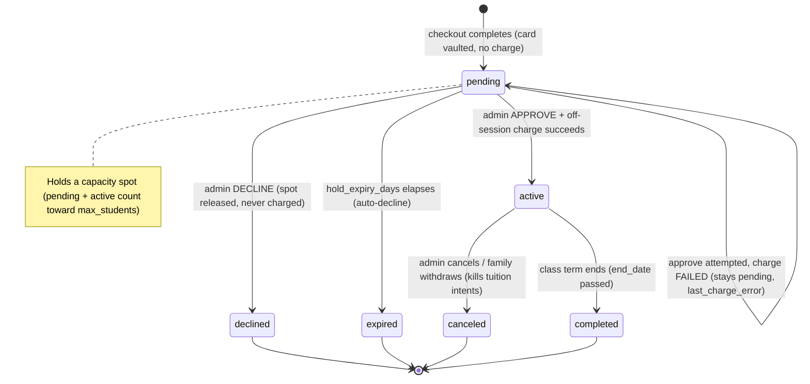
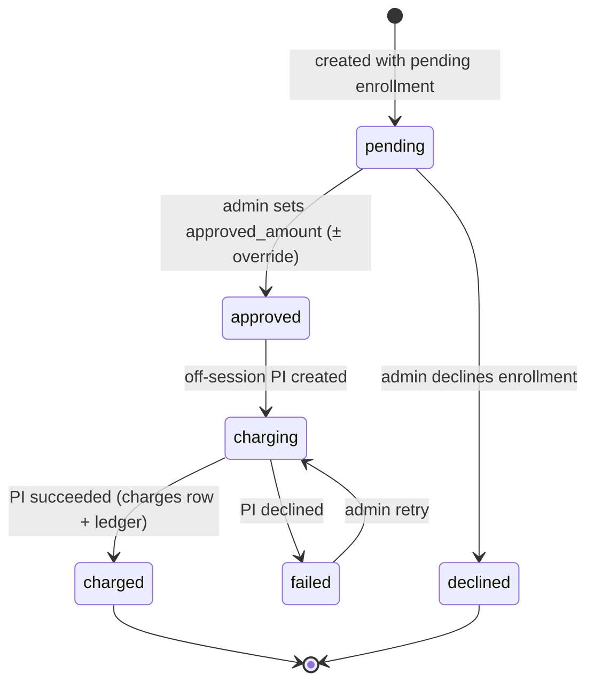
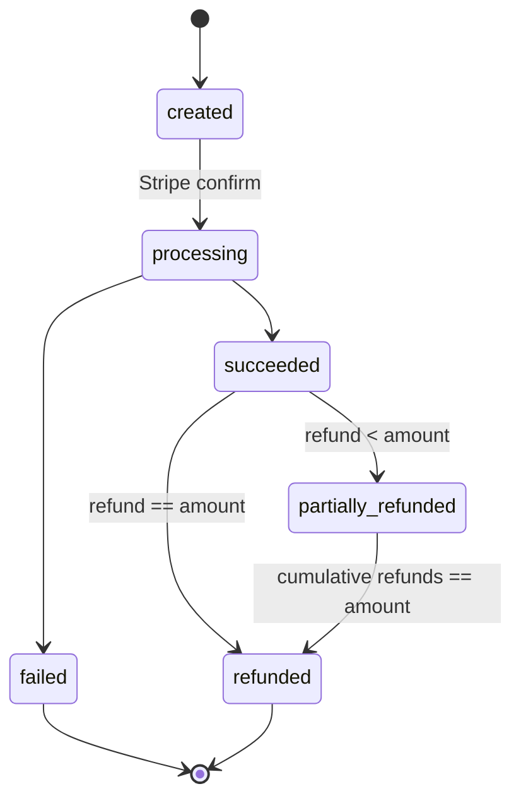
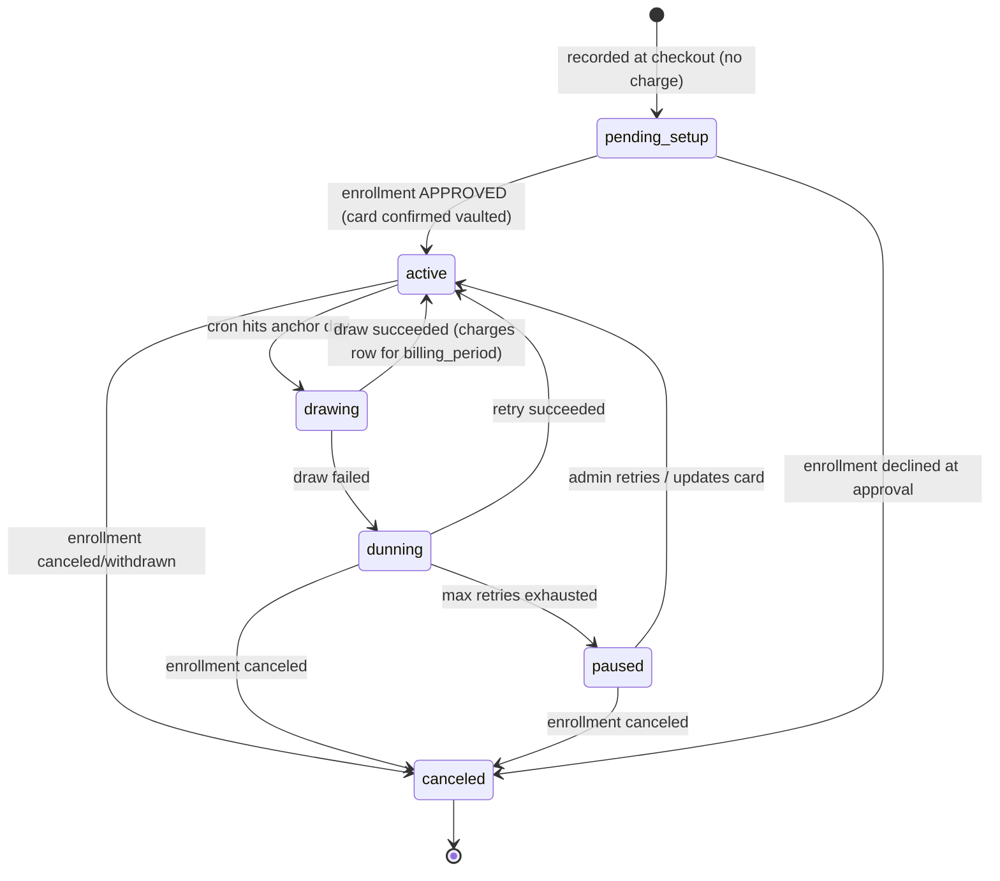

# BILLING_APPROVAL_AND_DRAW.md — Enrollment Approval, Charging & Monthly Tuition Draw

> **Status:** Draft spec — *spec only, no code yet.*
> **Author:** Platform build (Derek) · **Date:** 2026-07-17
> **Module:** M7 Registration & Enrollment + M-billing (Commerce)
> **Supersedes direction of:** `docs/AUTHORIZATION_CHECKOUT.md` §4 / §4.6 (which charges the
> registration fee inside the Stripe Checkout Session). Under this spec **nothing is charged at
> checkout except merchandise** — checkout becomes vault-only, and the registration fee moves to
> **admin approval time**. `AUTHORIZATION_CHECKOUT.md` should receive a deprecation header pointing
> here, and this file should be registered in `docs/_INDEX.md` as the canonical billing-approval /
> draw doc. (Follow-up — not done in this spec.)

---

## 0. Core model (the one-paragraph version)

A parent completes checkout. **No money moves** (except future merchandise). Checkout **vaults**
the card / captures the ACH mandate (Stripe `setup` mode), creates the enrollment as
**`status = "pending"`**, and records **pending charge items** — the registration fee plus the
first-month tuition, where the first month carries a **prorated recommendation** for mid-month
starts. The enrollment sits in an **admin approval queue**. When an admin **approves**, the platform
runs an **off-session charge** (registration + prorated first tuition) against the vaulted method,
**activates** the enrollment, posts the revenue to the **ledger**, and arms the **recurring monthly
tuition intent** (drawn on the anchor day, default the 15th). **Decline** releases the held spot and
notifies the parent, and nothing is ever charged. Every charge is written as a **reversible ledger
group** with a first-class `charges` record, so full and partial **refunds** are possible from day
one (refund *UI/workflow* is a separate follow-on; only the *data model* is specified here).

**Design invariants**
- **No charge at checkout except merch.** Registration + tuition are authorized-only until approval.
- **Admin approval is the single gate** between "parent paid attention" and "money moves."
- **Every money movement is a `charges` row + a balanced ledger group.** No ad-hoc Stripe calls
  that skip the ledger.
- **Refund-ready from day one** — partial refunds, each linked to its original charge, posted as a
  reversal group (`post_ledger_group(p_reversal_of => …)`, which already exists).
- **Idempotent everywhere** — webhooks retry, crons re-run; never double-create, never double-draw.

---

## 1. Checkout changes — from "charge registration" to "authorize / vault only"

### 1.1 Today (to be migrated)
`app/api/enrollment/checkout/route.ts` builds a Stripe **Checkout Session** in `mode: "payment"`
whose line items are the **immediate** lines (registration fee), with
`payment_intent_data.setup_future_usage = "off_session"` to vault the card. The
`app/api/enrollment/webhook/route.ts` handler, on `checkout.session.completed`, **creates the
enrollment as `status:"active"`**, posts the registration to the ledger as `direct_sale_captured`,
and records scheduled tuition intents. **This charges registration at checkout and auto-activates —
both change here.**

### 1.2 Target checkout

| Aspect | Today | Target |
|---|---|---|
| Stripe mode | `payment` (charges registration) | **`setup`** (no charge) — creates a `SetupIntent`, vaults card / captures ACH mandate |
| Money moved at checkout | Registration fee | **$0** for enrollment; **merch only** (see §1.3) |
| Enrollment status on completion | `active` | **`pending`** |
| Registration / first tuition | Charged now | Recorded as **pending charge items** (§2), charged at approval (§3) |
| Card persistence | On PI success | On `setup_intent.succeeded` → persist `payment_method` to `families.stripe_payment_method_id` |

**Webhook events after migration** (enrollment path):
- `checkout.session.completed` with a **setup-mode** session → create/confirm the `pending`
  enrollment, persist the vaulted `payment_method` to the family, generate the pending charge items.
  (Setup mode has no `payment_status`/settlement concern — the ACH *mandate* is captured, not a
  debit.)
- `setup_intent.succeeded` (belt-and-suspenders) → ensure `families.stripe_payment_method_id` is set.
- `checkout.session.expired` → mark cart expired (unchanged).
- The current `async_payment_succeeded` / `async_payment_failed` handlers for enrollment become
  **unused for enrollment** (no debit at checkout) — they remain only for the **merch** charge path.

**Idempotency anchor stays the same shape:** pending enrollment keyed on
`(setup_intent_id or checkout_session_id, student_id, class_id)`. The current key uses
`stripe_payment_intent_id`; in setup mode there is no PaymentIntent, so add a
`stripe_setup_intent_id` / `checkout_session_id` anchor (see §9).

### 1.3 Merchandise line-item split (charge-at-checkout, future)

Merch is the **one** thing that *does* charge at checkout. Design the cart/line model now so merch
can be added cleanly later without re-plumbing:

- Every cart line carries a **`settlement_mode`**: `"charge_now"` (merch) | `"authorize"`
  (enrollment: registration + tuition).
- Checkout builds **two buckets**:
  - **charge_now bucket** → a `payment`-mode Checkout Session (or a separate PaymentIntent) that
    captures immediately and posts a `direct_sale_captured` ledger group for merch.
  - **authorize bucket** → the `setup`-mode vaulting flow above; produces pending charge items.
- A mixed cart (merch + enrollment) → **one setup for the card** + **one immediate charge for
  merch**, or two sequential Stripe sessions. Recommended: reuse the same vaulted PM — vault first
  (setup), then immediately charge merch off-session against the just-vaulted PM in the same flow.
  (Decide at build time; not blocking.)
- `checkout-lines.ts` generalizes from `{ immediate, scheduled }` to
  `{ chargeNow, authorizeThenApprove, scheduled }`. Registration moves out of `immediate` into
  `authorizeThenApprove`.

---

## 2. Pending charge items (the approval-queue payload)

When a `pending` enrollment is created, generate one **`enrollment_charge_item`** row per amount the
admin will approve:

| item_type | recommended_amount_cents | Notes |
|---|---|---|
| `registration` | `studio_settings.registration_fee_cents` | One-time; may be waived on override (§3) |
| `first_tuition` | **prorated** full-month tuition (§4) | Recommendation; admin can override |

Each item is `status = "pending"` and carries the **recommendation** plus a `proration` JSON blob
(so the admin sees *why* the number is what it is). Registration is a flat recommendation with no
proration blob. The **recurring** monthly tuition is *not* a charge item — it's the
`tuition_schedule_intent` (§5), armed only after approval.

---

## 3. Admin approval queue

### 3.1 Route & view
- **`/admin/enrollment/approvals`** (new) — the queue of `pending` enrollments, newest first, each
  showing: student, class, family, day/time, **capacity impact**, and its **pending charge items**
  with recommended amounts and the proration breakdown. Filter by class/season/status.
- Extends (does not replace) the existing read-only `/admin/enrollments` list.

### 3.2 Actions

**Approve** (per enrollment; per-item override allowed first):
1. For each pending charge item, admin may **override** `approved_amount_cents` (incl. `0` to waive)
   with an **`override_reason`** (required when override ≠ recommendation). Override is **logged**
   (§4.4).
2. Sum the approved items → **one off-session PaymentIntent** against
   `families.stripe_payment_method_id` (`off_session: true, confirm: true, customer =
   families.stripe_customer_id`).
3. On **success**:
   - Create a **`charges`** row (kind `registration_plus_first_tuition`, or split into two charges —
     see §6.2) linked to the PaymentIntent; write `charge_id` back onto the charge items.
   - Post a balanced **ledger group** (`revenue_registration` + `revenue_tuition` legs) via
     `post_ledger_group` (idempotent on `posting_key`).
   - **Activate** the enrollment (`pending → active`), stamp `approved_by`, `approved_at`.
   - **Arm the recurring intent**: `tuition_schedule_intent.status: pending_setup → active`,
     set `monthly_amount_cents` (full month, **not** prorated), `anchor_day`, `next_draw_at`.
   - **Capacity**: convert the held spot to a confirmed spot (§3.3).
   - Send the **enrollment confirmation** email (existing `sendEnrollmentConfirmation`).
4. On **charge failure** (card declined off-session): enrollment stays `pending` with a
   `last_charge_error`; item(s) → `failed`; **notify admin**; admin can retry / update card / decline.
   Nothing activates. (See charge state machine §8.2.)

**Decline** (per enrollment):
- Enrollment `pending → declined`, `declined_reason` recorded.
- **Release the held spot** (§3.3) so capacity frees immediately.
- Charge items → `declined`. **Nothing is ever charged** (card was only vaulted).
- **Notify the parent** (email via existing hook; optional in-app if the parent has a portal
  account) with a friendly message + re-enroll path.
- The vaulted PM may be left on the Stripe Customer (harmless) or detached (open question §10).

**Charge now** (per scheduled item — see §4 of notifications, wired here): lets an admin draw a
`tuition_schedule_intent` (or any future scheduled item) **before** its anchor day. Same off-session
charge + ledger + `charges` row as the cron (§5), tagged `source = "manual"`.

### 3.3 Do pending enrollments hold capacity?

**Recommendation: YES — pending holds a spot** (prevents overbooking a class between checkout and
approval, which would force declines the studio can't honor).

- Capacity = `count(enrollments WHERE status IN ('pending','active'))` against `classes.max_students`.
- Do **not** bump `classes.enrolled_count` until **active**; instead compute capacity from
  `pending + active` at read time, OR track a separate `held_count`. (Pick one at build; computing
  from status avoids a counter-drift bug like the historical `enrolled_count`/`enrollment_count`
  issue.)
- **Hold expiry:** a pending enrollment auto-declines after **`studio_settings.hold_expiry_days`**
  (default TBD — open question §10) via the daily cron, releasing the spot. Parent notified.
- If a class is **full of pending holds**, new enrollees go to **waitlist** (existing `waitlist`
  status), not a second pending hold.

---

## 4. Proration (first-month tuition recommendation)

### 4.1 Formula (recommended: **meeting-based**)

```
recommended_first_tuition_cents =
    round( full_month_tuition_cents * (meetings_remaining / meetings_in_month) )
```

- `full_month_tuition_cents` — resolved tuition for the class (`resolveClassPriceCents`, see
  `lib/billing/resolve-price.ts`).
- `meetings_in_month` — number of class sessions in the **proration month** (count of the class's
  `day_of_week` occurrences in that calendar month, minus studio closures if we want to be exact —
  open question §10).
- `meetings_remaining` — sessions on/after the **first-attendance date** through month end.
- **Proration month** = the calendar month of the **class start** if the class starts this month or
  a future month; if the class already started and the family enrolls mid-term, the proration month
  is the **approval month** (they pay for the remaining sessions of the current month). *This edge is
  flagged to Amanda (§10).*

### 4.2 Alternative (calendar-day) — documented, not default

```
recommended_first_tuition_cents =
    round( full_month_tuition_cents * (days_remaining / days_in_month) )
```

Simpler but less fair for weekly classes (a class meeting only Mondays shouldn't be priced by
calendar days). Meeting-based is the default; the method is stored per studio in
`studio_settings.proration_method` (`'meeting' | 'calendar_day' | 'none'`) so white-label studios can
choose.

### 4.3 Rounding & bounds
- `Math.round` to whole cents (consistent with `dollarsToPriceCents`).
- Clamp to `[0, full_month_tuition_cents]`.
- If `meetings_remaining >= meetings_in_month` (enrolled before the month's first session) →
  **full month** (no discount).
- If the class starts in a **future** month entirely → first tuition = **full month of the start
  month** (no proration), unless Amanda wants otherwise (§10).

### 4.4 Admin override + audit
- The queue shows: recommended amount, the proration blob
  (`{ method, full_month_cents, meetings_in_month, meetings_remaining, first_attendance_date }`), and
  an **editable** approved amount.
- Any `approved_amount_cents ≠ recommended_amount_cents` requires an `override_reason`.
- Overrides are logged to **`charge_item_overrides`** (or an append-only `audit_log` row):
  `{ charge_item_id, admin_id, old_cents, new_cents, reason, created_at }`. Immutable.

---

## 5. The 15th-of-month draw engine

### 5.1 Trigger
- **New daily cron:** `/api/cron/tuition-draw`, e.g. `"0 15 * * *"` (mid-day UTC to avoid TZ edge
  around local midnight) registered in `vercel.json`. Runs **daily**, not monthly, so per-class
  `anchor_day` values and month-length clamping all work with one job.
- Cron auth via the existing cron-secret pattern used by the other `/api/cron/*` routes.

### 5.2 Selection query (per run, per tenant)
Draw an intent when **all** hold:
- `status = 'active'`
- **anchor matches today:** `effective_anchor_day(anchor_day, today) = day_of_month(today)`, where
  `effective_anchor_day` **clamps** to month length (anchor 31 in Feb → 28/29; anchor 15 always 15).
- **not already drawn this period:** no `charges` / `tuition_draws` row for
  `(intent_id, billing_period = 'YYYY-MM')`.

### 5.3 Charge
- Off-session: `paymentIntents.create({ amount: monthly_amount_cents, currency, customer:
  family.stripe_customer_id, payment_method: family.stripe_payment_method_id, off_session: true,
  confirm: true, metadata: { intent_id, billing_period, tenant_id } })`.
- **On success:** create `charges` (kind `monthly_tuition`, `billing_period` set), post
  `revenue_tuition` ledger group, set `intent.last_drawn_period`, `intent.next_draw_at`, reset
  `failure_count = 0`.
- **On failure** (`card_declined`, `authentication_required`, etc.): `intent → dunning`,
  `failure_count++`, schedule retry, create a `charges` row with `status = 'failed'` (so failures are
  visible + reversible-accounting-clean), **notify admin + parent**.

### 5.4 Idempotency — never double-draw a month
- **Hard guarantee:** `UNIQUE(intent_id, billing_period)` on the draw record (`charges` where
  kind = `monthly_tuition`, or a dedicated `tuition_draws` ledger table). The cron inserts the draw
  record **first** (or uses `ON CONFLICT DO NOTHING`); only on successful insert does it call Stripe.
  A re-run in the same day/month no-ops.
- Also pass a Stripe **idempotency key** = `draw:{intent_id}:{billing_period}` on `create` so even a
  crash between insert and Stripe response can't double-charge.

### 5.5 Retry / dunning
- Retry schedule (proposal, tune per Amanda §10): **+1 day, +3 days, +5 days**, then **pause**.
- Each retry re-attempts the *same* `billing_period` (still guarded by the unique key — a success
  flips the failed record, it does not create a second).
- State: `active → dunning → (success) active` or `dunning → (max retries) paused`.
- `paused` intents are surfaced in an admin **"Payment problems"** view; admin can retry / update PM
  / cancel. (View is minimal here; detailed dunning UX is a follow-on.)
- **Notifications** each failure (admin + parent) via the existing notification system.

### 5.6 Canceling an enrollment kills its intent
- **Cancel hook:** setting `enrollments.status → canceled` (or `withdrawn`) **must** set every
  linked `tuition_schedule_intent.status → canceled` (and `canceled_at`), so the cron never draws it
  again. Enforce via `enrollment_id` FK on the intent + an application-level cancel service (and,
  belt-and-suspenders, a DB trigger or a cron guard that skips intents whose enrollment isn't
  `active`).
- No proration/refund of the *current* month happens automatically on cancel — that's a **refund**
  decision (§6, and policy §10).

---

## 6. Refund-ready data model

Refund **workflow/UI is out of scope** (separate follow-on). This section specifies only the
**data model** so refunds — full and **partial** — are supported from day one.

### 6.1 `charges` — the money-moved record (source of truth for reversibility)
One row per Stripe charge attempt (approval charge, monthly draw, merch, manual "charge now").

Key columns (full DDL in §9):
`id, tenant_id, family_id, enrollment_id (nullable), student_id (nullable), class_id (nullable),
kind, amount_cents, currency, status, stripe_payment_intent_id, stripe_charge_id, billing_period
(nullable, 'YYYY-MM'), ledger_posting_key, source ('approval'|'draw'|'manual'|'merch'),
created_by (admin uuid | 'system'), refunded_total_cents (default 0), metadata jsonb, created_at,
captured_at, updated_at.`

- `status`: `created | processing | succeeded | failed | canceled | refunded | partially_refunded`.
- `refunded_total_cents` is maintained as refunds post; `status` flips to `partially_refunded` /
  `refunded` when `refunded_total_cents` is `> 0` / `= amount_cents`.

### 6.2 One combined approval charge, or two?
**Recommendation: split the approval into two `charges` rows** (registration + first_tuition) even
though it's **one** Stripe PaymentIntent, OR run **two** PaymentIntents. Rationale: partial refunds
often target *just* tuition or *just* registration; separate charge rows make "refund the tuition,
keep the registration" a clean, linkable operation. If we keep one PaymentIntent for two charge
rows, each charge row records its **share** and refunds are apportioned per row. (Decide at build;
the model supports either — flagged §10.)

### 6.3 `refunds` — each linked to its charge
`id, tenant_id, charge_id (FK → charges), amount_cents, is_partial (computed), reason_code, reason
(free text), stripe_refund_id, ledger_reversal_posting_key, status ('created'|'succeeded'|'failed'),
refunded_by (admin uuid), created_at.`

- **Partial supported:** `amount_cents ≤ charges.amount_cents − charges.refunded_total_cents`
  (enforced in the refund service; a CHECK can guard non-negativity but the running total needs app
  logic).
- `reason` / `reason_code` **required** (Amanda's partial-credit rationale).
- On success: **post a reversal ledger group** via `post_ledger_group(p_reversal_of =>
  original_posting_key, …)` — the ledger already supports `p_reversal_of` (see the webhook's RPC
  bridge). The reversal group debits the revenue account and credits cash/clearing for
  `amount_cents`. Update `charges.refunded_total_cents` and `status`.
- Multiple partial refunds per charge are allowed until the running total hits `amount_cents`.

### 6.4 Why this is enough for day one
- Every charge → a `charges` row + a ledger group (a `posting_key`).
- Every refund → a `refunds` row linked by `charge_id` + a **reversal** ledger group referencing the
  original `posting_key`.
- Full refund = refund summing to `amount_cents`; partial = anything less. No schema change needed
  when the refund UI ships.

---

## 7 & 8. State machines

### 8.1 Enrollment status



Waitlist is an orthogonal entry state (`waitlist → pending` when a spot frees), unchanged from today.

### 8.2 Charge item + charge + tuition intent

**Charge item (approval line):**


**`charges` record:**


**`tuition_schedule_intent` (recurring):**


---

## 9. Exact table changes

> All changes are **additive** and must use `IF NOT EXISTS` / `ADD COLUMN IF NOT EXISTS` /
> `DROP POLICY IF EXISTS` per project migration protocol. Migrations run in Derek's Regular
> Terminal, **never** through Claude Code. Column names below are proposals — verify against
> `types/database.types.ts` before writing the migration.

### 9.1 New tables

**`enrollment_charge_items`** — the approval-queue line items
| col | type | note |
|---|---|---|
| id | uuid pk | |
| tenant_id | uuid not null | |
| enrollment_id | uuid fk → enrollments | |
| family_id | uuid | |
| student_id | uuid | |
| class_id | uuid | |
| item_type | text | `registration` \| `first_tuition` |
| recommended_amount_cents | int not null | |
| approved_amount_cents | int null | set at approval (override-able) |
| override_reason | text null | required when approved ≠ recommended |
| proration | jsonb null | `{method, full_month_cents, meetings_in_month, meetings_remaining, first_attendance_date}` |
| status | text | `pending\|approved\|charging\|charged\|declined\|failed` |
| charge_id | uuid null fk → charges | |
| created_at / updated_at | timestamptz | |

**`charges`** — money-moved records (§6.1). UNIQUE partial index
`UNIQUE(intent_id, billing_period)` **where** `kind='monthly_tuition'` for draw idempotency (via a
nullable `intent_id` column referencing `tuition_schedule_intent`).

**`refunds`** — §6.3. FK `charge_id → charges`.

**`charge_item_overrides`** (or reuse a general `audit_log`) — §4.4, append-only.

**Optional `tuition_draws`** — if we prefer a dedicated draw-ledger table over reusing `charges`
for the unique `(intent_id, billing_period)` guard. Recommendation: **reuse `charges`** with the
partial unique index to avoid a parallel table.

### 9.2 Column additions

**`enrollments`** (currently: `tenant_id, family_id, student_id, class_id, status,
enrollment_type, stripe_payment_intent_id, amount_paid_cents, enrolled_at, …`):
- `stripe_setup_intent_id text` and/or `checkout_session_id text` — new idempotency anchor (setup
  mode has no PaymentIntent).
- `approved_by uuid null`, `approved_at timestamptz null`
- `declined_reason text null`, `declined_at timestamptz null`
- `hold_expires_at timestamptz null`
- `last_charge_error text null`
- (keep `status` as text; new values `pending`, `declined`, `expired`, `canceled` — confirm the
  CHECK constraint / no enum cast, per the dropped `user_role` lesson.)

**`tuition_schedule_intent`** (currently: `tenant_id, family_id, student_id, class_id,
monthly_amount_cents, anchor_day, status, source_ref, created_at, updated_at`):
- `enrollment_id uuid null fk → enrollments` — so cancel cascades and draws link back.
- `last_drawn_period text null` (`'YYYY-MM'`), `next_draw_at timestamptz null`
- `failure_count int not null default 0`, `last_failure_at timestamptz null`,
  `last_failure_code text null`
- `canceled_at timestamptz null`
- new `status` values: `active`, `dunning`, `paused`, `canceled` (currently only `pending_setup`).

**`studio_settings`**:
- `proration_method text default 'meeting'`
- `hold_expiry_days int null` (null = holds never auto-expire — Amanda decides §10)
- `tuition_anchor_day int default 15`
- (registration_fee_cents already exists.)

**`families`**: `stripe_customer_id`, `stripe_payment_method_id` already exist — no change.

### 9.3 RLS
- New tables: admin-only write; `charges`/`refunds`/`charge_items` **read** = admin + (optionally)
  the owning family for the portal billing view. Use the existing `is_admin()` SECURITY DEFINER
  helper; add family-scoped read policies keyed on `family_id`.
- Cron writes via **service role** (bypasses RLS), like the webhook.

### 9.4 Post-migration
- `NOTIFY pgrst, 'reload schema';`
- Regenerate `types/database.types.ts`, then `tsc --noEmit` clean before any code.

---

## 4-bis (cross-ref). Admin notifications

Wire into the **existing notification architecture** (in-app notifications + Resend email hook —
confirm the exact table/service at build):
- **New pending charges arrive** (enrollment enters `pending`) → notify admins (in-app + email) with
  a deep link to `/admin/enrollment/approvals`. This is what lets Amanda **charge before the 15th**
  if she wants.
- **"Charge now"** action (§3.2) on any scheduled tuition intent or pending item → immediate
  off-session draw, same ledger/`charges` path as the cron, tagged `source='manual'`.
- **Draw failure / dunning** (§5.5) → admin + parent notifications.
- **Hold expiry** auto-decline → parent notification.

---

## 10. Open questions for Amanda

**Refund policy (needed before the refund follow-on, but shapes the data model defaults):**
1. **Refund deadline?** Is there a window (e.g., refundable within N days of a charge, or before the
   class's first meeting) after which no refunds — or is it always at Amanda's discretion?
2. **Partial-credit rules.** Any standard partial amounts (e.g., prorated remaining sessions on a
   mid-month withdrawal), or fully case-by-case? Should canceling mid-month **auto-propose** a
   prorated credit, or is every refund manual?
3. **Registration fee refundable?** Ever, or non-refundable once charged?
4. **Reason codes.** A fixed picklist (withdrawal, studio-canceled class, goodwill, billing error…)
   or free-text only?

**Approval & proration:**
5. **Mid-term join proration month** (§4.1) — if a family enrolls into a class that already started,
   do they pay the prorated **remaining sessions of the current month**, or start clean next month?
6. **Do studio closures reduce `meetings_in_month`?** (More accurate proration, more complexity.)
7. **Future-start classes** (§4.3) — first tuition = **full month of the start month**, or prorate
   the start month too?
8. **Waive registration** — is waiving common enough to want a one-click "waive" (override to $0), or
   is that rare?

**Capacity & holds:**
9. **Hold duration** (§3.3) — how long may a `pending` enrollment hold a spot before auto-decline?
   (Suggest 3–5 days; `null` = never.) Should a full-of-holds class push new enrollees to waitlist?
10. **Auto-decline behavior** — on expiry, silently release + notify, or require an admin to clear it?

**Draw & dunning:**
11. **Anchor day** — confirm the **15th** for all tuition (per-class override ever needed?).
12. **Retry cadence & cap** (§5.5) — accept **+1/+3/+5 days then pause**, or different?
13. **After max retries** — pause the intent (spot kept, admin follows up) or auto-cancel the
    enrollment?

**Checkout:**
14. **Mixed merch + enrollment carts** (§1.3) — is that a real near-term scenario, or is merch always
    a standalone purchase? (Affects whether we build the two-bucket checkout now or defer.)
15. **Detach vaulted card on decline** (§3.2) — leave it on the Stripe Customer, or remove it?

---

## Appendix — files this spec will touch (for the build follow-on, not this spec)
- `app/api/enrollment/checkout/route.ts` — `payment` → `setup` mode; pending enrollment; charge items.
- `app/api/enrollment/webhook/route.ts` — stop charging/auto-activating; handle setup-mode + vault.
- `lib/billing/checkout-lines.ts` — `{chargeNow, authorizeThenApprove, scheduled}` split.
- `lib/billing/resolve-price.ts` — reused for full-month tuition (proration base).
- **new** `lib/billing/proration.ts` — meeting-based proration (pure, testable).
- **new** `lib/billing/draw.ts` + `app/api/cron/tuition-draw/route.ts` — the engine.
- **new** `lib/billing/charges.ts` + `lib/billing/refunds.ts` — charge/refund services + ledger.
- **new** `app/(admin)/admin/enrollment/approvals/*` — the approval queue.
- `lib/billing/ledger-posting.ts` — add `buildReversalGroup` for refunds (uses existing
  `p_reversal_of`).
- `vercel.json` — register the daily `tuition-draw` cron.
- Notifications wiring (existing system).

*End of spec. No code written. Migrations to be authored and run by Derek in the Regular Terminal
after Amanda's answers to §10.*
